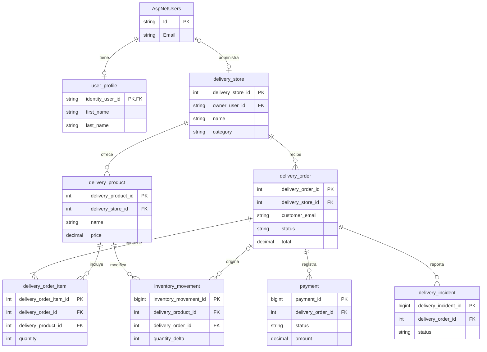
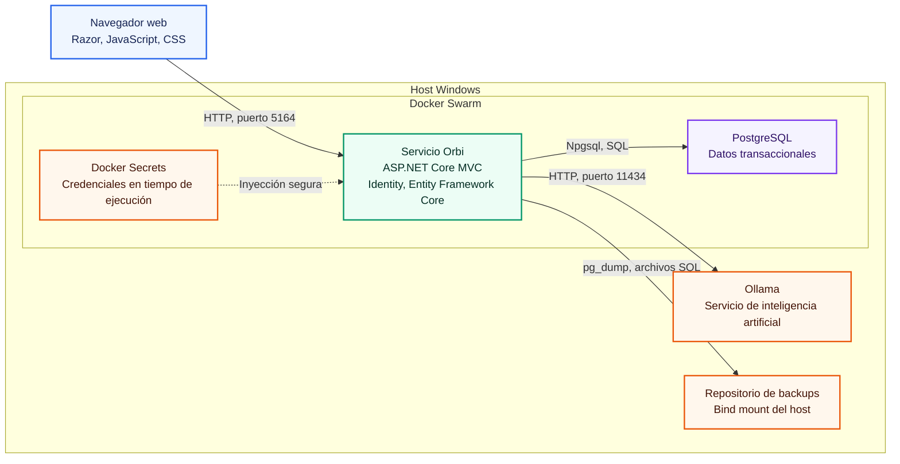
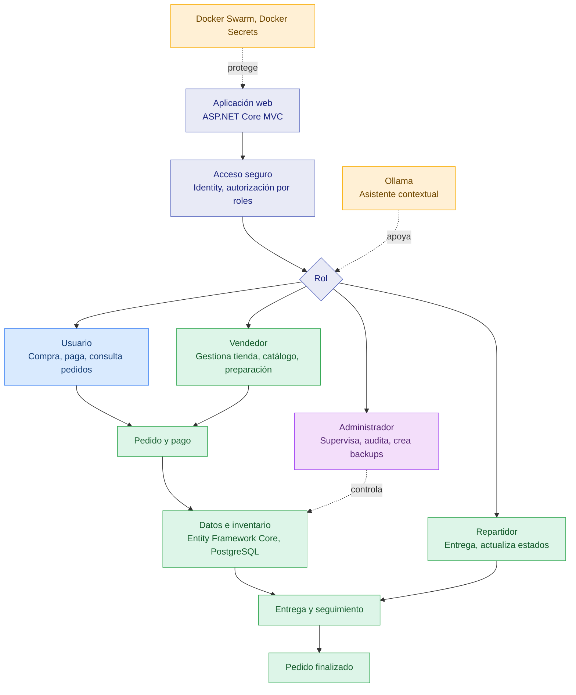

# Orbi

## Tabla de contenido

1. Resumen
2. Tecnologias usadas
3. Dependencias
4. Pasarela de pago
5. Google MFA
6. Google SMTP
7. Seeder
8. Docker stack
9. Docker swarm
10. Configuración program.cs
11. Integración ollama, backend y base de datos, asistente de autocompletado
12. Diagrama ER
13. Diagrama Arquitectura
14. Diagrama flujo
15. Backups
16. Generación masiva de datos

## 1. Resumen

Orbi es una plataforma de comercio y entregas para Ecuador. Conecta usuarios, vendedores, repartidores y administradores mediante catálogos por tienda, pedidos, pagos, inventario, seguimiento, incidentes, auditoría y análisis de ventas.

El acceso se controla por roles. El usuario compra y consulta pedidos, el vendedor administra su tienda y catálogo, el repartidor gestiona entregas y el administrador supervisa toda la operación.

## 2. Tecnologias usadas

- .NET 10
- ASP.NET Core MVC
- Razor Pages
- C Sharp
- JavaScript y CSS
- Entity Framework Core
- ASP.NET Core Identity
- PostgreSQL 18
- Npgsql
- Docker y Docker Swarm
- Docker Secrets
- Ollama
- Mermaid

## 3. Dependencias

- MailKit 4.17.0 para correo SMTP
- Microsoft.AspNetCore.Authentication.Google 10.0.2 para acceso con Google
- Microsoft.AspNetCore.Identity.EntityFrameworkCore 10.0.2 para identidad y roles
- Microsoft.AspNetCore.Identity.UI 10.0.2 para las páginas de cuenta
- Microsoft.EntityFrameworkCore.Design 10.0.2 para diseño y migraciones
- Microsoft.EntityFrameworkCore.SqlServer 10.0.2 como proveedor disponible
- Microsoft.EntityFrameworkCore.Tools 10.0.2 para herramientas de Entity Framework Core
- Microsoft.VisualStudio.Web.CodeGeneration.Design 10.0.2 para generación de código
- Npgsql.EntityFrameworkCore.PostgreSQL 10.0.1 para PostgreSQL
- Bogus 35.6.5 y Npgsql 10.0.1 en el generador masivo

La restauración de paquetes se realiza con:

```powershell
dotnet restore .\src\SakilaApp.csproj
```

## 4. Pasarela de pago

La aplicación integra PayPal en entorno Sandbox y PayPhone. El backend crea la orden de pago, redirige al proveedor, procesa el retorno y registra el resultado en PostgreSQL.

PayPal utiliza ClientId, ClientSecret, BaseUrl, ReturnUrl, CancelUrl y CurrencyCode. PayPhone utiliza Token y StoreId. Los valores sensibles se entregan al contenedor mediante Docker Secrets y nunca deben almacenarse en el repositorio.

## 5. Google MFA

ASP.NET Core Identity implementa autenticación multifactor con aplicaciones compatibles con TOTP, como Google Authenticator. El usuario vincula su aplicación mediante un código QR, valida el código temporal y recibe códigos de recuperación.

El sistema permite recordar el dispositivo, regenerar códigos, restablecer la clave y desactivar la autenticación multifactor desde la sección de seguridad de la cuenta.

## 6. Google SMTP

GmailEmailSender utiliza MailKit, Gmail SMTP, el puerto 587 y StartTls. Envía confirmaciones de cuenta, enlaces de recuperación y códigos de restablecimiento.

La dirección remitente y la contraseña de aplicación se cargan mediante los secretos email_sender_email y email_password. EmailQueueWorker procesa el envío en segundo plano.

## 7. Seeder

IdentitySeeder se ejecuta durante el inicio de la aplicación después de aplicar las migraciones y preparar el esquema. Crea o actualiza roles, usuarios de demostración, perfiles, direcciones, tiendas, productos, pedidos, pagos, movimientos de inventario e incidentes.

El proceso busca registros existentes antes de insertar, por lo que puede ejecutarse nuevamente sin duplicar los datos principales.

## 8. Docker stack

docker-stack.yml define los servicios orbiapp y postgres, la red overlay sakila_overlay, los volúmenes persistentes, los secretos externos, las políticas de reinicio y las comprobaciones de salud.

La imagen y el stack se crean con:

```powershell
docker build -t orbiapp:latest .
docker stack deploy -c docker-stack.yml orbi-stack
docker service ls
```

La aplicación publica el puerto 5164 y PostgreSQL publica el puerto 5433. El servicio web utiliza PostgreSQL 18 y accede a Ollama en el host.

## 9. Docker swarm

Docker Swarm administra la ejecución y recuperación de los servicios. El nodo que conserva los datos de PostgreSQL debe estar activo y tener la etiqueta requerida por el stack.

```powershell
docker swarm init
docker node update --availability active docker-desktop
docker node update --label-add sakila.postgres-data=true docker-desktop
docker stack deploy -c docker-stack.yml orbi-stack
docker node ls
docker service ls
```

El estado esperado es una réplica disponible para orbiapp y una para postgres.

## 10. Configuración program.cs

Program.cs configura la cultura monetaria, Data Protection, los clientes HTTP, MVC, Razor Pages, PostgreSQL, Identity, roles, correo, backups y autenticación con Google.

Durante el inicio aplica las migraciones de Identity, ejecuta orbi-schema.sql y orbi-locations.sql, llama a IdentitySeeder y carga orbi-data.sql cuando está disponible. Después activa archivos estáticos, autenticación, autorización, rutas MVC y Razor Pages.

Las credenciales y direcciones de servicios se resuelven desde appsettings, variables de entorno y Docker Secrets.

## 11. Integración ollama, backend y base de datos, asistente de autocompletado

OllamaProductService conecta el backend con Ollama mediante HTTP y utiliza el modelo configurado en Ollama__Model. El chat recibe el nombre, correo, rol, pantalla actual y datos autorizados obtenidos desde PostgreSQL.

HomeController prepara el contexto según el rol. El administrador recibe lectura global, mientras que los demás roles reciben catálogo y registros vinculados con su cuenta. La respuesta se transmite por fragmentos y una segunda revisión comprueba que el resultado responda la pregunta.

El vendedor dispone de autocompletado y sugerencia de precios. DeliveryController combina el análisis de tiendas externas con OllamaProductService, explica el criterio aplicado y permite aceptar el valor sugerido en el formulario de inventario.

## 12. Diagrama ER



## 13. Diagrama Arquitectura



## 14. Diagrama flujo



## 15. Backups

BackupService ejecuta pg_dump en segundo plano y guarda archivos SQL con fecha UTC. docker-stack.yml configura BACKUP_DIR como /backups, un intervalo de cinco minutos y una retención de cinco archivos.

El directorio /backups está conectado con la carpeta backups del host Windows mediante un bind mount. Después de cada respaldo, CleanupOldBackups ordena los archivos recientes y elimina los que superan la retención.

La restauración crea primero un respaldo de seguridad, reinicia el esquema público y ejecuta psql. Si la operación falla, intenta recuperar automáticamente el estado anterior.

```powershell
Get-ChildItem -LiteralPath .\backups -Filter orbi_backup_*.sql -File | Sort-Object LastWriteTimeUtc -Descending
```

## 16. Generación masiva de datos

OrbiApp.DataGenerator es una aplicación de consola independiente. Utiliza Bogus con locale en español, una semilla reproducible y escritura binaria por lotes mediante Npgsql.

El plan distribuye los registros entre tiendas, productos, perfiles, pedidos, detalles, pagos, movimientos de inventario, auditoría e incidentes. Respeta las relaciones y exige al menos mil registros.

La configuración predeterminada genera 1,000,000 de registros en lotes de 5,000 con la semilla 2026.

```powershell
dotnet run --project src\OrbiApp.DataGenerator -- --records 1000000 --batch-size 5000 --seed 2026 --locale es --reference-date 2026-07-01T00:00:00Z --reset
```

Sin la opción reset, el generador se niega a escribir si ya existen datos de negocio. La opción only-products limita la ejecución a productos para tiendas existentes.
