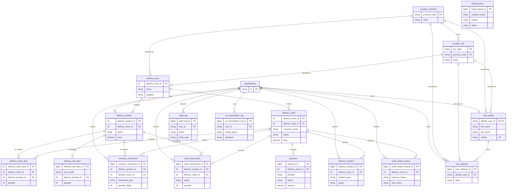

# Diagrama Entidad-Relación — Orbi App

```mermaid
erDiagram

    AspNetUsers {
        string Id PK
    }

    ecuador_province {
        string province_code PK
        string name
    }

    ecuador_city {
        string city_code PK
        string province_code FK
        string name
    }

    user_profile {
        string identity_user_id PK, FK
        string first_name
        string last_name
        string cedula UK
    }

    user_address {
        bigint user_address_id PK
        string identity_user_id FK
        string label
    }

    delivery_store {
        int delivery_store_id PK
        string name
        string category
    }

    delivery_product {
        int delivery_product_id PK
        int delivery_store_id FK
        string name
        decimal price
    }

    delivery_order {
        int delivery_order_id PK
        int delivery_store_id FK
        string customer_email
        string status
        decimal total
    }

    delivery_order_item {
        int delivery_order_item_id PK
        int delivery_order_id FK
        int delivery_product_id FK
        int quantity
    }

    payment {
        bigint payment_id PK
        int delivery_order_id FK
        string provider
        string status
        decimal amount
    }

    delivery_cart_item {
        bigint delivery_cart_item_id PK
        string user_email
        int delivery_product_id FK
        int quantity
    }

    inventory_movement {
        bigint inventory_movement_id PK
        int delivery_product_id FK
        int delivery_order_id FK
        string movement_type
        int quantity_delta
    }

    delivery_incident {
        bigint delivery_incident_id PK
        int delivery_order_id FK
        string incident_type
        string status
    }

    audit_log {
        bigint audit_log_id PK
        string user_id FK
        string action
        string entity_type
    }

    order_status_history {
        bigint order_status_history_id PK
        int delivery_order_id FK
        string previous_status
        string new_status
    }

    stock_reservation {
        bigint stock_reservation_id PK
        int delivery_product_id FK
        int delivery_order_id FK
        string status
        int quantity
    }

    email_queue {
        bigint email_queue_id PK
        string recipient_email
        string subject
        string status
    }

    ai_consumption_log {
        bigint ai_consumption_log_id PK
        string user_id FK
        string model_name
        string operation
    }

    AspNetUsers ||--o| user_profile : "tiene"
    AspNetUsers ||--o{ user_address : "tiene"
    AspNetUsers ||--o{ delivery_product : "crea"
    AspNetUsers ||--o{ inventory_movement : "realiza"
    AspNetUsers ||--o{ delivery_incident : "reporta"
    AspNetUsers ||--o{ audit_log : "ejecuta"
    AspNetUsers ||--o{ order_status_history : "cambia"
    AspNetUsers ||--o{ stock_reservation : "reserva"
    AspNetUsers ||--o{ ai_consumption_log : "usa"

    ecuador_province ||--o{ ecuador_city : "tiene"
    ecuador_province ||--o{ delivery_store : "ubicada en"
    ecuador_province ||--o{ user_profile : "ubicado en"
    ecuador_province ||--o{ user_address : "ubicada en"

    ecuador_city ||--o{ delivery_store : "ubicada en"
    ecuador_city ||--o{ user_profile : "ubicado en"
    ecuador_city ||--o{ user_address : "ubicada en"

    user_profile ||--o{ user_address : "tiene"

    delivery_store ||--o{ delivery_product : "contiene"
    delivery_store ||--o{ delivery_order : "recibe"

    delivery_product ||--o{ delivery_order_item : "se ordena"
    delivery_product ||--o{ delivery_cart_item : "se agrega"
    delivery_product ||--o{ inventory_movement : "se mueve"
    delivery_product ||--o{ stock_reservation : "se reserva"

    delivery_order ||--o{ delivery_order_item : "contiene"
    delivery_order ||--o{ payment : "se paga"
    delivery_order ||--o{ delivery_incident : "genera"
    delivery_order ||--o{ order_status_history : "historial"
    delivery_order ||--o{ stock_reservation : "reserva"
    delivery_order ||--o{ inventory_movement : "afecta"
```
